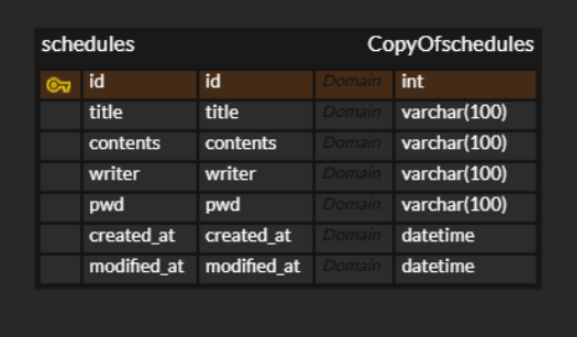

# sparta-scheduleapp

---
1. [일정관리 앱 API 명세서](#일정관리-앱-API-명세서)
2. [ERD](#ERD)
---

## 일정관리 앱 API 명세서

|    기능    | Method |           URL           |  request   |  response  |     상태코드     |
|:--------:|:------:|:-----------------------:|:----------:|:----------:|:------------:|
|   일정생성   |  POST  |       /schedules        |  요청 body   |   일정 정보    | 201 : 정상 등록  |
| 전체 일정 조회 |  GET   |       /schedules        |  요청 param  |  다건 응답 정보  |  200: 정상 조회  |
| 선택 일정 조회 |  GET   | /schedules/{scheduleId} |  요청 param  |  단건 응답 정보  |  200: 정상조회   |
| 선택 일정 수정 | PATCH  | /schedules/{scheduleId} |  요청 body   |   수정 정보    |  200: 정상 수정  |
| 선택 일정 삭제 | DELETE | /schedules/{scheduleId} |  요청 param  |     -      |  200: 정상 삭제  |

<br/>

---

## 1. 일정 생성

| Method | URL        |
|:------:|------------|
|  POST  | /schedules |

<br/>

### request
```json=
{
    "title": "제목3333",
    "contents": "내용1",
    "writer": "작성자",
    "pwd": "1234"
}
```

<br/>

### response
```json=
{
    "id": 2,
    "title": "제목22222",
    "contents": "내용1111",
    "writer": "작성자11",
    "pwd": "1234",
    "createdAt": "2024-11-07T20:17:38.000+00:00",
    "modifiedAt": "2024-11-07T20:17:38.000+00:00"
}
```

<br/>

### 상태코드
| Code | Description |
|:----:|:-----------:|
| 201  |  일정 생성 성공   |
| 400  |  일정 생성 실패   |


<br/>
<br/>

---

## 2. 전체 일정 조회

| Method | URL        |
|:------:|------------|
|  GET   | /schedules |

<br/>

### response
```json=
[
    {
        "id": 2,
        "title": "제목22222",
        "contents": "내용1111",
        "writer": "작성자11",
        "pwd": "1234",
        "createdAt": "2024-11-07T20:17:38.000+00:00",
        "modifiedAt": "2024-11-08T00:15:13.000+00:00"
    },
    {
        "id": 4,
        "title": "제목22222",
        "contents": "내용1111",
        "writer": "작성자11",
        "pwd": "1234",
        "createdAt": "2024-11-07T20:17:38.000+00:00",
        "modifiedAt": "2024-11-08T00:15:13.000+00:00"
    },
    {
        "id": 5,
        "title": "제목22222",
        "contents": "내용1111",
        "writer": "작성자11",
        "pwd": "1234",
        "createdAt": "2024-11-07T20:17:38.000+00:00",
        "modifiedAt": "2024-11-08T00:15:13.000+00:00"
    }
]
```
<br/>

### 상태코드
| Code | Description |
|:----:|:-----------:|
| 200  |  전체 조회 성공   |
| 400  |  전체 조회 실패   |


<br/>
<br/>

---

## 3. 선택 일정 조회

| Method | URL                     |
|:------:|-------------------------|
|  GET   | /schedules/{scheduleId} |

<br/>

### response
```json=
{
    "id": 2,
    "title": "제목22222",
    "contents": "내용1111",
    "writer": "작성자11",
    "pwd": "1234",
    "createdAt": "2024-11-07T20:17:38.000+00:00",
    "modifiedAt": "2024-11-07T20:17:38.000+00:00"
}
```

### 상태코드
| Code | Description |
|:----:|:-----------:|
| 200  |  선택 조회 성공   |
| 400  |  선택 조회 실패   |


<br/>
<br/>

---

## 4. 선택 일정 수정

| Method | URL                     |
|:------:|-------------------------|
| PATCH  | /schedules/{scheduleId} |

<br/>

### request
```json=
{
    "title": "제목22222",
    "contents": "내용1111",
    "writer": "작성자11"
}
```

### response
```json=
{
    "id": 2,
    "title": "제목22222",
    "contents": "내용1111",
    "writer": "작성자11",
    "createdAt": "2024-11-07T20:17:38.000+00:00",
    "modifiedAt": "2024-11-07T20:17:38.000+00:00"
}
```

### 상태코드
| Code | Description |
|:----:|:-----------:|
| 200  |  일정 수정 성공   |
| 400  |  일정 수정 실패   |
| 401  |    권한 없음    |


<br/>
<br/>

---

## 5. 선택 일정 삭제

| Method | URL                     |
|:------:|-------------------------|
| DELETE | /schedules/{scheduleId} |

<br/>

### request
```json=
{
    "pwd": "1234"
}
```


### 상태코드
| Code | Description |
|:----:|:-----------:|
| 200  |  일정 삭제 성공   |
| 400  |  일정 삭제 실패   |
| 403  |    권한 없음    |

<br/>

---

## ERD
